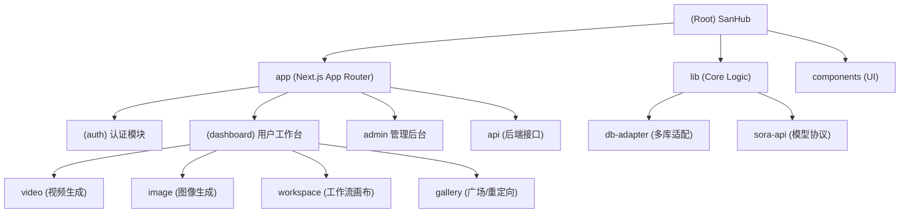

<!-- OPENSPEC:START -->
# OpenSpec Instructions

These instructions are for AI assistants working in this project.

Always open `@/openspec/AGENTS.md` when the request:
- Mentions planning or proposals (words like proposal, spec, change, plan)
- Introduces new capabilities, breaking changes, architecture shifts, or big performance/security work
- Sounds ambiguous and you need the authoritative spec before coding

Use `@/openspec/AGENTS.md` to learn:
- How to create and apply change proposals
- Spec format and conventions
- Project structure and guidelines

Keep this managed block so 'openspec update' can refresh the instructions.

<!-- OPENSPEC:END -->

# SanHub 项目指南

> 更新时间：2026-01-24 22:25:00

## 1. 项目愿景与架构
SanHub 是一个集成了多种 AI 生成服务（Sora, Gemini, Z-Image）的统一创作平台。
采用 Next.js 14 (App Router) 全栈架构，核心特色是支持 **SQLite/MySQL 无缝切换**。

### 模块结构图

## 2. 模块索引
| 模块名称 | 路径 | 职责 | 关键入口 |
|:---|:---|:---|:---|
| **Video** | `app/(dashboard)/video` | 视频生成、分镜、Remix | `page.tsx`, `useVideoGeneration.ts` |
| **Workspace** | `app/(dashboard)/workspace` | **节点式工作流画布** | `page.tsx`, `hooks/useNodeOperations.ts` |
| **Admin** | `app/admin` | 用户、模型、渠道管理 | `page.tsx`, `api/admin/*` |
| **Auth** | `app/(auth)` & `lib/auth.ts` | 登录注册、NextAuth 集成 | `api/auth/[...nextauth]` |
| **Core Lib** | `lib/` | 数据库适配、工具函数、API 封装 | `db-adapter.ts`, `sora-api.ts` |

## 3. 核心技术细节

### Sora API 封装层 (`lib/sora-api.ts`)
实现了高鲁棒性的 OpenAI-style 视频生成客户端：
- **自适应轮询**: 根据任务进度 (0-30%, 30-70%, >70%) 动态调整轮询间隔 (5s/3s/2s)，并具备防停滞检测。
- **多格式兼容**: 能自动解析 NewAPI 包装 ({code, message: string})、纯 JSON、甚至 URL 编码的嵌套响应。
- **重定向追踪**: 针对 `/content` 端点，支持捕获 302 Location header 获取真实 CDN 地址。
- **功能覆盖**: 支持 Video Generation, Remix, Character Card, Feed 流。

### 鉴权与安全 (`lib/auth.ts` & `app/admin`)
- **双重角色**: 支持 `admin` (超级管理员) 和 `moderator` (协管员) 访问后台。
- **实时 Session**: 每次 Session 回调都强制查库 (`getUserById`)，确保用户封禁 (`disabled`) 或余额变更立即生效，不依赖 JWT 缓存。

### 数据库适配层 (`lib/db-adapter.ts`)
为了同时支持本地开发 (SQLite) 和生产部署 (MySQL)，项目实现了一个抽象层：
- **工厂模式**: `createDatabaseAdapter()` 根据 `DB_TYPE` 环境变量返回实例。
- **SQL 兼容性**: `SQLiteAdapter` 内置了 `convertSQLToSQLite` 方法，通过正则自动转换 MySQL 语法（如 `AUTO_INCREMENT`, `ENUM`, `BIGINT`）为 SQLite 兼容语法。
- **连接池**: MySQL 模式下使用 `mysql2` 连接池，具备保活和队列限制功能。

## 4. 运行与开发
- **启动开发环境**: `npm run dev` (http://localhost:3000)
- **Docker 启动**: `docker-compose up -d`
- **数据库切换**: 修改 `.env` 中的 `DB_TYPE` (sqlite/mysql)
- **构建生产**: `npm run build` && `npm start`

## 5. 变更记录 (Changelog)
- **2026-02-03**:
  - 添加 Frontend Design Skill (`.claude/skills/frontend-design.md`)
  - 添加12星座喜好分镜模板 (`data/prompts/12星座喜好分镜.txt`)
  - 添加12星座工作流预设 (`lib/workflow-templates.ts`)
- **2026-01-24**:
  - 深度扫描 `lib/sora-api.ts`，完善 API 封装逻辑文档。
  - 明确 `app/admin` 的鉴权机制 (Role & Real-time Session)。
  - 标记 `app/gallery` 为重定向存根模块。
- **2026-01-24 (Previous)**: 深度扫描 Workspace 模块；完善 Video 模块 API 实现细节。

## 6. Skills 参考
| Skill | 路径 | 用途 |
|:---|:---|:---|
| Frontend Design | `.claude/skills/frontend-design.md` | 创建独特、生产级的前端界面，避免通用 AI 美学 |
| UI/UX Pro Max | `.claude/skills/ui-ux-pro-max.md` | 全面设计指南：50+风格、97配色、57字体、99 UX规则 |
